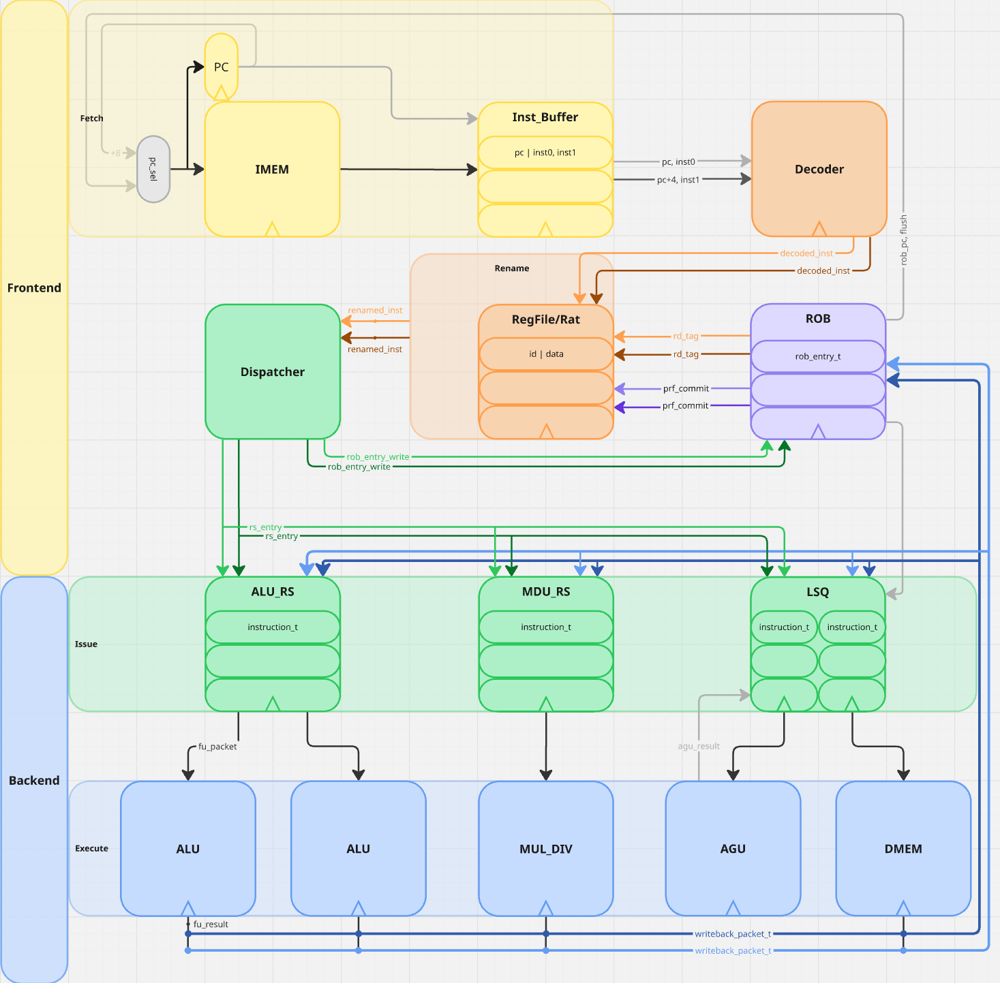
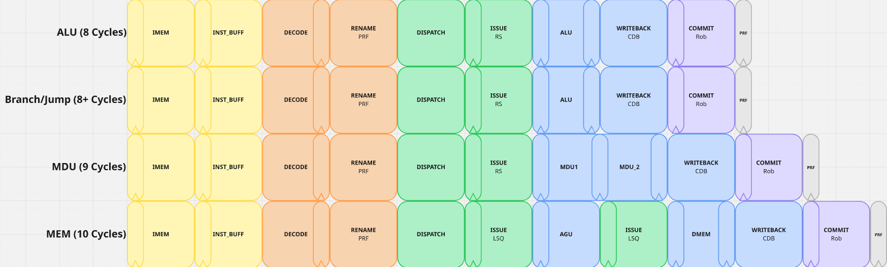
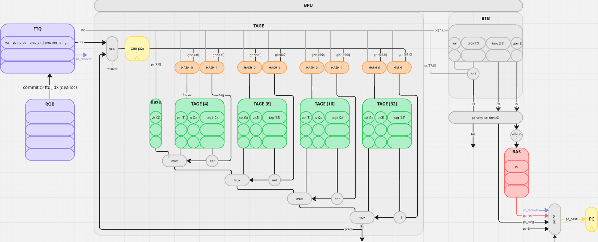

# Libre-V

### A Dual-Issue Out-of-Order RISC-V Core

This repository contains the SystemVerilog implementation of a dual-issue, out-of-order RISC-V core. It supports RV32IM and is organized as a speculative frontend feeding an out-of-order backend with in-order commit.

---

## Block Diagram



---

## Core Features

| Feature | Specification |
|---------|---------------|
| **ISA** | RISC-V RV32IM |
| **Execution Model** | Speculative Out-of-Order Execution with In-Order Commit |
| **Fetch Width** | 2 instructions per cycle |
| **Issue Width** | 2-Wide Superscalar |
| **Pipeline Depth** | 8-10 Stages |
| **Frontend Prediction** | BTB + TAGE + RAS + FTQ based speculative frontend |
| **Instruction Buffering** | Fetch-side instruction buffer decouples fetch from decode |
| **Register Renaming** | P6-style ROB-index-as-tag renaming scheme |
| **Scheduling Model** | Reservation-station style issue with out-of-order execution |
| **Commit Model** | In-order retirement with commit-time branch validation and frontend recovery |

---

## Microarchitectural Sizing

| Subsystem | Configuration |
|---|---|
| **Frontend Fetch** | Fetch width = 2, Instruction buffer depth = 8 |
| **Backend Width** | Dual-issue / dual-dispatch (`PIPE_WIDTH = 2`) |
| **ROB** | 32 entries |
| **ALU Reservation Station** | 8 entries |
| **MDU Reservation Station** | MDU RS = 4 entries |
| **Memory Ordering** | LSQ entries = 8 |
| **Execution Resources** | Functional units = 5, RS structures = 4 |
| **BTB** | 128 entries, 12-bit tags |
| **RAS** | 16 entries |
| **TAGE** | GHR = 32 bits, 4 tagged tables, base predictor = 512 entries, 256 entries/table, 8-bit tags |
| **FTQ** | 16 entries |

---

## Pipeline Stages



| Stage | Name | Files | Description |
|-------|------|-------|-------------|
| **1** | **Fetch** | `fetch.sv`, `predecoder.sv`, `inst_buffer.sv` | Issues IMEM requests using the predicted PC, receives instruction bundles, predecodes control-flow instructions, forms visible 2-instruction fetch groups, and buffers them for decode. Slot0 is older than slot1, and slot1 is only valid if slot0 does not redirect. The instruction buffer is part of this stage and provides fetch/decode decoupling plus flush support. |
| **2** | **Decode** | `decode.sv` | Decodes buffered instruction bits into internal control information. Extracts register fields and immediates, identifies instruction class and format, and prepares execution, memory, and control-flow metadata for the backend. |
| **3** | **Rename** | `prf.sv`, `rename.sv` | Maps architectural destination registers onto speculative tags using a P6-style ROB-index-as-tag scheme. Source operands are checked against rename state to determine whether they are ready from the architectural / committed view or whether they must wait on an in-flight producer identified by ROB tag. |
| **4** | **Dispatch** | `dispatch.sv` | Allocates backend bookkeeping and sends renamed operations into the proper backend structures. This stage writes entries into the ROB and issue structures, associates decoded / renamed metadata with backend control state, and transitions instructions from frontend sequencing into backend scheduling. |
| **5** | **Issue** | `issue.sv`, `rs.sv`, `lsq.sv` | Tracks operand readiness, wakes instructions when results become available, and selects ready instructions for execution. Enables out-of-order execution by issuing ready younger instructions ahead of older stalled instructions when dependencies permit. |
| **6** | **Execute** | `execute.sv`, `alu.sv`, `agu.sv`, `mdu.sv` | Performs actual computation in the functional units, including integer ALU operations, multiply / divide, address generation, and branch resolution. This is where resolved control-flow results are produced for later commit-time validation. |
| **7** | **Writeback** | `cdb.sv` | Broadcasts completed execution results to dependent structures, |
| **8** | **Commit** | `rob.sv` | Retires instructions in order, makes architectural state updates permanent, and validates fetch-time branch predictions against resolved outcomes. On mismatch, commit triggers frontend flush, redirect, GHR recovery, and RAS pointer recovery using FTQ metadata captured at fetch time. |

---

## Branch Prediction

**Files:** `bpu.sv`, `btb.sv`, `tage.sv`, `ras.sv`, `ftq.sv`, `branch_pkg.sv`



The frontend uses a speculative branch prediction subsystem to choose the next fetch PC and to record the metadata required for later validation and recovery.

| Structure | Role | Notes |
|-----------|------|-------|
| **BPU** | Top-level branch prediction control | Combines BTB, TAGE, RAS, and FTQ metadata to generate `pc_next`, `pc_vals`, predicted targets, and FTQ enqueue information. Also handles commit-time correction and redirect generation. |
| **BTB** | Target and branch-type prediction | Used for jumps, calls, returns, and conditional branches with known target information. For returns, BTB provides classification while the actual target may come from the RAS. |
| **TAGE** | Conditional branch direction prediction | Used only for `BRANCH_COND`. Includes a base predictor and tagged tables. Speculative GHR is updated at alloc / fetch-side time and repaired on mispredict using FTQ checkpoints. |
| **RAS** | Call / return prediction | Updated speculatively in the frontend. Calls and returns mutate RAS state early rather than at commit. Current recovery restores pointer state; exact speculative stack-content rollback is still a deferred enhancement. |
| **FTQ** | Fetch-time branch metadata tracking | Stores per-branch metadata from fetch until commit, including PC, predicted state, GHR checkpoint, and RAS checkpoint. Used at commit to validate predictions and recover frontend state on mispredict. |

### Branch Prediction Flow

| Step | Behavior |
|------|----------|
| **PC lookup** | The BPU reads predictor state using the current fetch PC. |
| **Prediction selection** | BTB provides target/type information, TAGE provides direction for conditional branches, and RAS may provide return targets. |
| **Next-PC generation** | The BPU chooses `pc_next` and determines per-slot validity through `pc_vals`. |
| **Fetch-time allocation** | When predecode discovers control-flow instructions in the returned fetch bundle, alloc metadata is generated and written into the FTQ. |
| **Speculative updates** | TAGE GHR and RAS state are updated speculatively at alloc / fetch-side time, not at commit. |
| **Commit-time validation** | The FTQ supplies the original predicted metadata so commit can determine whether actual outcome matched fetch-time prediction. |
| **Recovery** | On mispredict, the frontend flushes wrong-path state and restores speculative predictor checkpoints needed to restart from the corrected PC. |

---

## Register Renaming Scheme

**Files:** `prf.sv`, `rename.sv`, `rob.sv`,

The backend uses a **P6-style renaming model where the ROB index acts as the speculative destination tag**.

### Renaming Model

| Item | Description |
|------|-------------|
| **Destination Tag** | Each speculative destination register is renamed to the ROB slot allocated for that instruction. The ROB index therefore serves as the producer tag for dependency tracking. |
| **Source Lookup** | Source operands are checked against rename state to determine whether they refer to committed architectural data or to an in-flight producer identified by ROB tag. |
| **Dependency Tracking** | Consumers wait on producer ROB tags rather than on a separate physical register namespace. |
| **Wakeup** | When a producer completes, its tag becomes ready and dependent instructions can wake up through the backend scheduling logic. |
| **Commit Behavior** | At commit, the architectural state is updated in order, and speculative rename state is retired consistently with ROB order. |

### Why this scheme is useful

| Benefit | Explanation |
|---------|-------------|
| **Simple producer tracking** | The ROB already provides age ordering and in-flight instruction identity, so reusing its index as the speculative tag avoids a separate destination-tag namespace. |
| **Natural age ordering** | ROB index ordering aligns dependency tracking with retirement order, which simplifies many backend bookkeeping paths. |
| **Tight integration with commit** | Because the ROB is both the speculative ordering structure and the destination tag source, completion and retirement logic stay closely coupled. |

---

## Top-Level Integration

| File | Role |
|------|------|
| **`core.sv`** | Main processor integration file. Connects frontend prediction, fetch, decode, rename, dispatch, issue, execution, writeback, and commit into a single speculative out-of-order pipeline. |
| **`cpu.sv`** | System-facing wrapper around the core and its memory interfaces. |
| **`uarch_pkg.sv`** | Shared microarchitectural parameters, widths, queue sizes, and common data structures used across the design. |
| **`branch_pkg.sv`** | Shared branch-prediction and recovery structs used across the frontend. |
| **`riscv_isa_pkg.sv`** | ISA encodings and instruction-related constants used by decode and instruction handling logic. |

---

## Verification

| Area | Description |
|------|-------------|
| **Standalone Testbenches** | Block-level testbenches exist for major frontend components such as BTB, TAGE, FTQ, RAS, Fetch, and BPU. These validate local behavior before integrated testing. |
| **Integrated Frontend Testbench** | Verifies branch prediction, fetch, predecode, FTQ allocation / dequeue behavior, instruction buffering, redirect / flush handling, speculative GHR / RAS behavior, and recovery ordering. |
| **System-Level Testing** | Verilator-based simulation with assembled RV32IM programs validates the integrated processor beyond isolated frontend tests. |

---

## Results

| Benchmark       | IPC  | Notes                                            |
| --------------- | ---- | ------------------------------------------------ |
| RV32IM ISA Test | 0.45 | Heavy branch pressure and recovery cost dominate |
| Matrix Multiply | 1.60 | Demonstrates sustained IPC greater than 1        |

---

## Future Work

* [ ] L1 cache integration
* [ ] AXI Interface
* [ ] Acceleration?

---

## Building and Running

This project was developed primarily with **Verilator** and **Python 3** with a makefile for the workflow.

### Assemble a program

```bash
python3 riscv_assembler.py input_file.s output_file.hex
```

### Run simulation

```bash
make run tb=test_tb
make wave tb=test_tb
make regress
```
